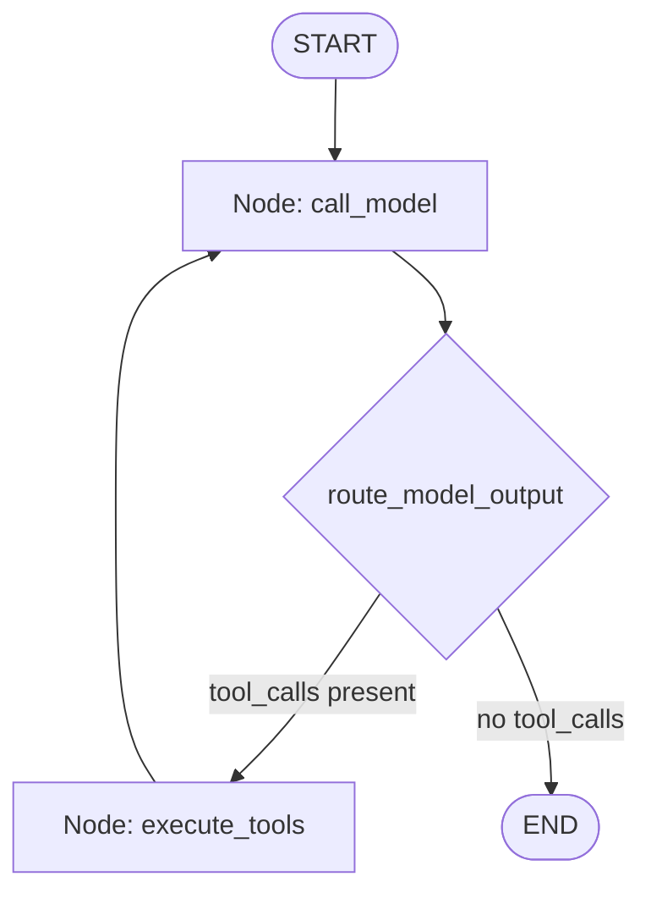
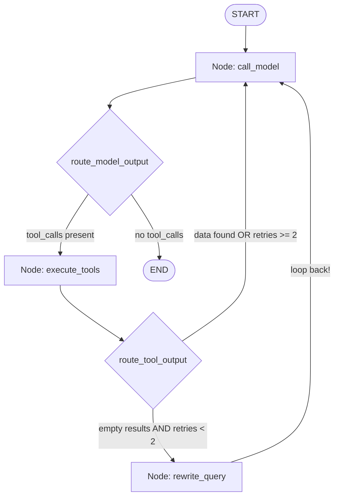

# Phase 4: Autonomous AI Agents

Welcome to **Phase 4: Autonomous AI Agents**. 

Where previous phases focused on static question-answering and retrieval (RAG), Phase 4 explores systems that take action, maintain durable state, recover from failures, and orchestrate complex tools using modern LangChain 1.0 and LangGraph 1.0 runtimes.

---

## Task 4.1: Rebuilt Tool-Calling CLI with `create_agent`

In **Task 2.6**, we hand-wrote a raw HTTP tool-calling loop from scratch with zero frameworks using `httpx`.
In **Task 4.1**, we rebuild that exact same system using modern `create_agent` from `langchain.agents` running on the LangGraph runtime, and map every single step of the execution trace back to our hand-rolled loop.

---

## 1. Quickstart & CLI Usage

### Installation
```bash
cd phase-4-agents
uv sync
```

### Run a Multi-Step Tool Query
```bash
uv run python src/phase_4_agents/agent_cli.py --query "What is the weather in Tokyo and London, and what is the difference between their temperatures?"
```

### Interactive REPL Mode
```bash
uv run python src/phase_4_agents/agent_cli.py
```

---

## 2. Step-by-Step Mapping: Task 2.6 Loop vs. Task 4.1 `create_agent`

The table below maps every single concept and step from the raw Python loop in Task 2.6 directly to the modern LangChain/LangGraph `create_agent` architecture:

| Step / Mechanism | Task 2.6: Hand-Rolled Loop (`tool_calling.py`) | Task 4.1: LangGraph `create_agent` (`agent_cli.py`) | What It Actually Does |
| :--- | :--- | :--- | :--- |
| **1. Tool Schema Declaration** | `get_tool_declarations()` returning raw JSON schema dictionaries (`{"name": "calculator", "parameters": {...}}`). | `@tool` decorator (`langchain_core.tools.tool`) inspecting Python type hints and docstrings. | Informs the LLM what functions exist, their descriptions, argument names, and types. |
| **2. Initial Prompt State** | `contents = [{"role": "user", "parts": [{"text": prompt}]}]` | `{"messages": [HumanMessage(content=prompt)]}` | Packages the user's initial input into the conversation state history. |
| **3. Model Invocation** | `client.post(endpoint_url, json={"contents": contents, "tools": tools_payload})` | `model.bind_tools(tools).invoke(state["messages"])` inside the `agent` graph node. | Sends the current history and tool definitions to the LLM to get the next decision. |
| **4. Tool Call Decision Extraction** | Iterating through `candidate["content"]["parts"]` looking for `"functionCall"` keys. | LangGraph inspects `AIMessage.tool_calls` list containing `name`, `args`, and unique `id`. | Detects whether the model produced conversational text or wants to invoke a function. |
| **5. Tool Execution** | Dispatch function `execute_calculator(fn_args)` or `execute_weather(city)`. | LangGraph `tools` node executing the matching `@tool` function with extracted `args`. | Invokes the actual Python code locally with the arguments generated by the model. |
| **6. Appending Tool Output** | Appending `{"role": "function", "parts": [{"functionResponse": {"response": {"output": result}}}]}` to `contents`. | Creating a `ToolMessage(content=str(result), tool_call_id=id)` and appending it to `messages`. | Supplies the execution result back into the prompt context so the model can read it. |
| **7. Looping Back** | `for iteration in range(1, max_iterations + 1):` repeating the HTTP request. | Conditional edge in LangGraph: if `tool_calls` present, edge routes back from `tools` node to `model` node. | Allows the model to inspect tool results and take follow-up actions or do multi-step math. |
| **8. Termination Condition** | `if not function_calls: break` | LangGraph conditional edge: if `not message.tool_calls`, route to `END` node. | Signals that the agent has completed all necessary reasoning and is ready to reply to the user. |
| **9. Infinite Loop Protection** | Hand-crafted `max_iterations = 10` check triggering `hit_guard = True`. | LangGraph `recursion_limit` (default: 25 steps) raising `GraphRecursionError`. | Guards against runaway API loops and exploding token billing. |

---

## 3. Real Execution Trace Walkthrough

When running:
> *"What is the weather in Tokyo and London, and what is the difference between their temperatures?"*

The agent produced the following **7-step trace**, demonstrating parallel tool calling, sequential math execution, and final synthesis:

```text
==============================================================================
 🤖 LANGCHAIN / LANGGRAPH CREATE_AGENT EXECUTION TRACE (TASK 4.1)
==============================================================================
QUESTION: What is the weather in Tokyo and London, and what is the difference between their temperatures?
TOTAL STEPS CAPTURED: 7
------------------------------------------------------------------------------

[Step 1] Actor: User (HumanMessage)
  Content: What is the weather in Tokyo and London, and what is the difference between their temperatures?
  -> Task 2.6 Hand-Rolled Mapping: Task 2.6: Initial conversation state initialized: contents = [{"role": "user", "parts": [{"text": prompt}]}]

[Step 2] Actor: Model (Tool Decision) (AIMessage)
  Tools Requested:
    • get_weather({'city': 'Tokyo'}) [ID: call_1712688]
    • get_weather({'city': 'London'}) [ID: call_1712689]
  -> Task 2.6 Hand-Rolled Mapping: Task 2.6: Model returned candidate with functionCall in parts; tool loop identified tool request and queued execution.

[Step 3] Actor: Tool Execution (ToolMessage)
  Content: Weather in Tokyo: Clear and Sunny, Temperature: 18°C, Humidity: 55%, Wind: 12 km/h.
  -> Task 2.6 Hand-Rolled Mapping: Task 2.6: Local function executed (execute_calculator / execute_weather) and result appended to conversation as {"role": "function", "parts": [{"functionResponse": ...}]}

[Step 4] Actor: Tool Execution (ToolMessage)
  Content: Weather in London: Overcast with light drizzle, Temperature: 11°C, Humidity: 82%, Wind: 20 km/h.
  -> Task 2.6 Hand-Rolled Mapping: Task 2.6: Local function executed (execute_calculator / execute_weather) and result appended to conversation as {"role": "function", "parts": [{"functionResponse": ...}]}

[Step 5] Actor: Model (Tool Decision) (AIMessage)
  Tools Requested:
    • calculator({'a': 18, 'operation': 'subtract', 'b': 11}) [ID: call_1977519]
  -> Task 2.6 Hand-Rolled Mapping: Task 2.6: Model returned candidate with functionCall in parts; tool loop identified tool request and queued execution.

[Step 6] Actor: Tool Execution (ToolMessage)
  Content: 7
  -> Task 2.6 Hand-Rolled Mapping: Task 2.6: Local function executed (execute_calculator / execute_weather) and result appended to conversation as {"role": "function", "parts": [{"functionResponse": ...}]}

[Step 7] Actor: Model (Final Answer) (AIMessage)
  Content: The weather in Tokyo is clear and sunny with a temperature of 18°C, while London is overcast with light drizzle and a temperature of 11°C. 

The difference in temperature between the two cities is 7°C.
  -> Task 2.6 Hand-Rolled Mapping: Task 2.6: Model returned text without functionCall; if not function_calls: break (loop terminated successfully).

==============================================================================
FINAL SYNTHESIZED ANSWER:
The weather in Tokyo is clear and sunny with a temperature of 18°C, while London is overcast with light drizzle and a temperature of 11°C. 

The difference in temperature between the two cities is 7°C.
==============================================================================
```

---

## 4. Why `create_agent` on LangGraph Matters

In Task 2.6, hand-rolling the loop was essential for understanding the HTTP anatomy of tool calling. However, in production:
1. **Branching & Persistence**: A raw `for` loop cannot save state to SQLite/Postgres between user inputs or survive a container restart. LangGraph checkpointing handles this natively.
2. **Human-in-the-Loop**: Halting execution before a destructive tool call (e.g., `refund_customer`) requires graph interrupts (`interrupt_before=["tools"]`), which is painful to hand-write.
3. **Streamed Events**: LangGraph streams token-by-token reasoning and tool start/end events out of the box.

`create_agent` gives you the speed of a single function call, while retaining the full power of the underlying LangGraph `CompiledStateGraph`.

---

## Task 4.2: Provider-Agnostic Setup with `init_chat_model`

In production, hardcoding a specific AI SDK (like Google GenAI or OpenAI) creates vendor lock-in. If Google has an outage or OpenAI slashes prices 50%, you shouldn't have to rewrite your agent logic, tool signatures, or loop execution.

Task 4.2 implements a **provider-agnostic architecture** where you can hot-swap between LLM providers with a **configuration change only — zero code modifications**.

### 1. The Frontend / Fullstack Analogy
Think of `init_chat_model` like **Prisma** or **Drizzle ORM** database adapters, or **NextAuth.js** storage adapters:
- Your application code writes high-level queries (`findMany`, `create`).
- You can switch the backing engine from PostgreSQL to SQLite or MySQL by simply altering `DATABASE_URL` in `.env`.
- In LangChain, `create_agent` and `@tool` are your application logic; `ChatGoogleGenerativeAI`, `ChatOpenAI`, or `MockToolChatModel` are the pluggable driver adapters underneath.

### 2. Supported Providers
1. **`google_genai`** (Google Gemini via `langchain-google-genai`): Default model `gemini-2.5-flash` or `gemini-1.5-flash`.
2. **`openai`** (OpenAI via `langchain-openai`): Default model `gpt-4o-mini` or `gpt-4o`.
3. **`mock`** (`MockToolChatModel`): Built-in deterministic mock model supporting offline tool binding (`bind_tools`), simulated multi-turn tool calling, and fast CI execution without external API keys.

### 3. Switching Providers

#### Option A: Via `.env` (Zero Code Change)
Edit `phase-4-agents/.env`:
```env
# Switch to OpenAI:
MODEL_PROVIDER=openai
MODEL_NAME=gpt-4o-mini
OPENAI_API_KEY=your_openai_api_key_here

# Or switch back to Google:
# MODEL_PROVIDER=google_genai
# MODEL_NAME=gemini-2.5-flash
# GEMINI_API_KEY=your_gemini_api_key_here

# Or offline mock for fast local development / testing:
# MODEL_PROVIDER=mock
# MODEL_NAME=mock-agent
```
Then run without arguments:
```bash
uv run python src/phase_4_agents/agent_cli.py --query "What is 15 multiplied by 4?"
```

#### Option B: Via Environment Variable Overrides
```bash
# Run with OpenAI
MODEL_PROVIDER=openai MODEL_NAME=gpt-4o-mini OPENAI_API_KEY=sk-... uv run python src/phase_4_agents/agent_cli.py --query "Calculate 25 * 4"

# Run with Mock Provider (offline, zero API keys required)
MODEL_PROVIDER=mock uv run python src/phase_4_agents/agent_cli.py --query "What is 10 plus 20?"
```

#### Option C: Via CLI Runtime Flags
```bash
# Explicitly select provider and model at runtime
uv run python src/phase_4_agents/agent_cli.py --provider mock --model mock-agent --query "What is the weather in Tokyo?"
```

### 4. Automated Verification
The provider-agnostic engine is backed by tests in `tests/test_provider_agnostic.py`:
- `test_provider_switch_via_settings_object`: Verifies instantiating Google, OpenAI, and Mock models from `Settings`.
- `test_provider_switch_via_env_variables`: Verifies dynamic switching purely via OS environment variables.
- `test_tool_binding_identical_across_providers`: Proves that tool declarations bind identically across both Google and OpenAI.
- `test_agent_execution_with_mock_provider`: Runs the entire multi-step LangGraph agent loop offline.

Run the test suite:
```bash
uv run pytest tests/
```

---

## Task 4.3: Converting Phase 3 Router into Autonomous Agent Tools

In **Phase 3 (Task 3.19 & 3.21)**, we built an **Adaptive RAG Router** (`router.py`) that classified each incoming query into one of four static destinations (`DIRECT_LLM`, `LOCAL_CORPUS`, `STRUCTURED_DB`, `WEB_SEARCH`).

In **Task 4.3**, we convert these four retrieval mechanisms into first-class LangChain/LangGraph `@tool` functions:
1. **`pdf_search`**: Search local Mars Odyssey engineering PDF manuals & ECLSS operating limits.
2. **`site_search`**: Search crawled website documentation & company capabilities.
3. **`db_query`**: Query structured relational SQL database tables (customers, orders, products, appointments).
4. **`web_search`**: Search live internet sources with citations for real-time news and 2026 releases.

### 1. Static Router vs. Autonomous Tool-Calling Agent

| Dimension | Phase 3 Router (`router.py`) | Phase 4 Agent Tools (`rag_tools.py`) |
| :--- | :--- | :--- |
| **Decision Architecture** | Single upfront classification prompt before any retrieval occurs. | Dynamic tool-calling loop: the LLM inspects tools and decides when to call them. |
| **Multi-Source Queries** | Cannot handle: forced to pick exactly ONE route. | Can call multiple tools across different sources in sequence or parallel. |
| **Iterative Refinement** | Fails if the selected route yields zero results. | Can inspect tool results and call another tool or adjust arguments. |
| **Frontend Equivalent** | A static Express/Next.js URL routing table (`/pdf`, `/db`, `/web`). | A dynamic GraphQL / tRPC executor that orchestrates multiple microservices on demand. |

### 2. The Four RAG Tools

- **`pdf_search(query: str)`**:
  Scans markdown-converted PDF engineering manuals in `data/pdf_corpus/` (Mars ECLSS cabin pressure limits, propulsion specs, thermal loops). Formats results with document citations (`[pdf_02_nuclear_reactor_specs.md]`) and relevance scores.
- **`site_search(query: str)`**:
  Scans crawled documentation chunks (`data/scraped_docs/chunks.json`) and company capability pages. Returns matched page titles, URLs, and section heading paths.
- **`db_query(query: str)`**:
  Executes read-only SQL queries or natural language lookups against `ecommerce.db` (customers, orders, products, appointments).
  - *Security guard*: Strictly rejects destructive SQL (`DROP`, `DELETE`, `UPDATE`, `INSERT`, `ALTER`, `TRUNCATE`).
  - *Returns*: Executed SQL statement, record count, and structured row data.
- **`web_search(query: str)`**:
  Connects to DuckDuckGo search (with automatic fallback to curated sources) for live 2026 events, breaking news, and external facts.

### 3. Running the Autonomous Agent

#### Querying Each Knowledge Domain:
```bash
# 1. Mars Engineering PDF specs
uv run python src/phase_4_agents/agent_cli.py --query "What are the ECLSS pressure limits in our Mars PDF manuals?"

# 2. Company website capabilities
uv run python src/phase_4_agents/agent_cli.py --query "What digital innovation services does Toobler offer on the website?"

# 3. Relational SQL database
uv run python src/phase_4_agents/agent_cli.py --query "Find customers living in San Francisco"

# 4. Live web search (2026 news)
uv run python src/phase_4_agents/agent_cli.py --query "What are the latest 2026 Artemis updates?"

# 5. Direct response (no tools needed for chit-chat)
uv run python src/phase_4_agents/agent_cli.py --query "Hello! How are you today?"
```

#### Equipping Specific Toolsets:
```bash
# Equip with all 6 tools (4 RAG tools + calculator + weather)
uv run python src/phase_4_agents/agent_cli.py --tools all

# Equip only with RAG tools
uv run python src/phase_4_agents/agent_cli.py --tools rag

# Equip only with basic math & weather tools
uv run python src/phase_4_agents/agent_cli.py --tools basic
```

### 4. Automated Tests
Task 4.3 includes comprehensive unit and integration tests in `tests/test_rag_tools.py`:
- `test_pdf_search_returns_citations_and_excerpts`: Verifies PDF search output formatting and document brackets.
- `test_site_search_returns_chunks`: Verifies URL, title, and section matching.
- `test_db_query_natural_language` & `test_db_query_raw_sql`: Verifies natural language and SQL execution.
- `test_db_query_blocks_destructive_sql`: Verifies rejection of mutations (`DROP`, `DELETE`).
- `test_web_search_returns_citations`: Verifies live/fallback web search formatting.
- `test_agent_chooses_*`: Verifies the LangGraph agent autonomously selects the correct tool for each domain.
- `test_agent_answers_greetings_directly_without_tools`: Verifies zero tool calls on greetings.

Run all tests:
```bash
uv run pytest tests/test_rag_tools.py
```

---

## Task 4.4: Explicit LangGraph `StateGraph` Architecture

In **Task 4.1 to 4.3**, we utilized LangChain's high-level `create_agent` factory function.
In **Task 4.4**, we drop down to the engine level and rebuild the agent as an explicit **`StateGraph`** with a typed state schema, explicit nodes, and deterministic edges.

### 1. The Redux / XState Mental Model
For frontend engineers:
- **`AgentState`** is the **Redux State** / **XState Context**: An immutable typed data shape storing conversation history and step metrics.
- **`add_messages`** is the **Redux Reducer**: An accumulator that appends incoming messages to history instead of overwriting the list.
- **Nodes (`call_model`, `execute_tools`)** are **State Actions**: Functions that receive the current state and return state diffs.
- **Edges (`START`, conditional router, `END`)** are **State Transitions**: Deterministic routing based on model outputs.

### 2. Graph Topology



### 3. Core Primitives (`graph_agent.py`)

#### A. Typed State Schema
```python
class AgentState(TypedDict, total=False):
    messages: Annotated[Sequence[BaseMessage], add_messages]
    step_count: int
```

#### B. Explicit Nodes
1. **`call_model(state: AgentState)`**:
   Prepend system prompt, invoke model with `bind_tools(active_tools)`, and return new `AIMessage`.
2. **`execute_tools(state: AgentState)`**:
   Execute requested tools using `ToolNode(active_tools)`, producing `ToolMessage` outputs.

#### C. Explicit Router
```python
def route_model_output(state: AgentState) -> Literal["execute_tools", "__end__"]:
    last_msg = state["messages"][-1]
    if isinstance(last_msg, AIMessage) and getattr(last_msg, "tool_calls", None):
        return "execute_tools"
    return "__end__"
```

### 4. Running the StateGraph Engine via CLI

```bash
# Run with explicit StateGraph engine (default)
uv run python src/phase_4_agents/agent_cli.py --engine state_graph --query "What are the ECLSS pressure limits in our Mars PDF manuals?"

# Compare against high-level create_agent
uv run python src/phase_4_agents/agent_cli.py --engine create_agent --query "What are the ECLSS pressure limits in our Mars PDF manuals?"
```

### 5. Automated Tests
Tested in `tests/test_graph_agent.py`:
- `test_agent_state_schema_structure`: Validates `TypedDict` annotations.
- `test_route_model_output_conditional_router`: Validates routing decisions.
- `test_state_graph_compilation`: Validates `call_model` and `execute_tools` nodes.
- `test_state_graph_direct_response_path`: Validates single-turn `START -> call_model -> END`.
- `test_state_graph_tool_execution_loop`: Validates `START -> call_model -> execute_tools -> call_model -> END`.
- `test_state_graph_custom_toolset`: Validates partial toolbinding.
- `test_cli_integration_with_state_graph_engine`: Validates end-to-end CLI execution.

Run the test suite:
```bash
uv run pytest tests/test_graph_agent.py
```

---

## Task 4.5: Corrective Retrieval Cycle & Self-Correction Loop

In **Task 4.4**, our StateGraph had a single loop: `call_model -> execute_tools -> call_model`. If a search tool returned zero results or irrelevant data, the model was forced to hallucinate or admit defeat immediately.

In **Task 4.5**, we implement **Corrective RAG (CRAG)** by adding an explicit **Relevance Evaluator**, a **Query Rewriter**, and a **Cyclic Retry Edge** that loops back to try broader queries up to 2 times.

### 1. The Marvel Analogy: JARVIS Adjusting Sensor Sweep
Think of Iron Man searching for an enemy in an empty radar sector:
- **First sweep**: "Scanning sector for Atlantis..." -> Result: Nothing detected (`0 rows`).
- **Standard Agent (Task 4.4)**: Throws hands up: *"Target does not exist, Sir."*
- **Corrective Agent (Task 4.5)**: JARVIS self-corrects: *"No signal on narrow band. Broadening sensor sweep to regional grid (customers)..."* -> Result: Match found!

In TypeScript / React terms, this is an **XState retry guard** with an exponential backoff / retry counter pattern (`retryCount < 2 ? 'RETRY' : 'FALLBACK'`).

### 2. Graph Topology with Cycle



### 3. State Schema & Safety Guards

#### A. State Schema Extension
```python
class AgentState(TypedDict, total=False):
    messages: Annotated[Sequence[BaseMessage], add_messages]
    step_count: int
    rewrite_count: int  # Capped strictly at 2
```

#### B. Relevance Evaluator
```python
def is_retrieval_empty_or_irrelevant(content_or_message: str | BaseMessage) -> bool:
    """Detects empty indicators like '0 rows', 'No matching records found', etc."""
```

#### C. Conditional Tool Router & Termination Guard
```python
def route_tool_output(state: AgentState) -> Literal["rewrite_query", "call_model"]:
    curr_retries = state.get("rewrite_count", 0)
    if curr_retries >= 2:
        return "call_model"  # Termination guard: cap at 2 attempts!
    
    last_tool_msg = state["messages"][-1]
    if is_retrieval_empty_or_irrelevant(last_tool_msg):
        return "rewrite_query"
    return "call_model"
```

### 4. Verification & Testing

Tested in `tests/test_retry_cycle.py`:
1. `test_evaluator_identifies_empty_or_irrelevant_retrievals`: Validates miss detection across all 4 RAG tools.
2. `test_rewrite_search_query_strips_noise`: Validates query cleaning and heuristic expansion.
3. `test_route_tool_output_conditional_router`: Validates routing decisions based on state.
4. `test_agent_retry_cycle_succeeds_on_second_attempt`: Runs unmatchable query `Find customers living in Atlantis` -> retries to `customers` -> succeeds on attempt 2.
5. `test_agent_terminates_after_max_two_retries`: Tests impossible query, verifying that `rewrite_count` reaches exactly 2 and cleanly halts at `call_model -> END`.

```bash
uv run pytest tests/test_retry_cycle.py
```

---

## Task 4.6: Postgres Checkpointer with Process Interruption & Resumption

In **Tasks 4.1 to 4.5**, state was held entirely in Python process RAM (`MemorySaver` or ephemeral runtime state). 

### Why In-Memory State is for Demos Only
In production:
- A backend server crashes, pods restart (Kubernetes OOMKills, rolling updates).
- A multi-step agent query takes 30 seconds, and during step 2 the machine restarts.
- **In-Memory**: All conversation context, intermediate variables, tool results, and retry counters are lost permanently. The user sees a 500 error and has to re-explain everything.
- **Durable Checkpointer (`PostgresSaver`)**: After **every single node execution**, LangGraph serializes state into PostgreSQL tables (`checkpoints`, `checkpoint_writes`, `checkpoint_blobs`). If the process dies at step 3, a brand new process starts, reads the checkpoint for `thread_id`, and resumes from step 4 as if nothing happened.

### 1. PostgreSQL Schema Topology

Using `langgraph-checkpoint-postgres`, state is persisted to PostgreSQL (running on port `5433` in Docker):

```text
PostgreSQL Database: langgraph
├── checkpoints
│   ├── thread_id (e.g. "session-404")
│   ├── checkpoint_id (UUID / timestamp)
│   ├── parent_checkpoint_id
│   └── type, metadata
├── checkpoint_blobs
│   └── Channel state data (messages, step_count, rewrite_count)
└── checkpoint_writes
    └── Pending writes and intermediate task events
```

### 2. Live Process Interruption & Resumption CLI Demo

We equipped `agent_cli.py` with `--simulate-kill` and `--resume` flags to demonstrate durability across process lifecycles.

#### Step 1: Start Process 1 and Kill Mid-Run
Run a query on a dedicated session thread, instructing the agent to halt before executing tools:
```bash
uv run python src/phase_4_agents/agent_cli.py \
  --provider mock \
  --thread-id session-matrix-1 \
  --query "Find customers living in Tokyo" \
  --simulate-kill
```
Output:
```text
[Process 1] Starting run on thread 'session-matrix-1'...
[Process 1] Executing until interrupt point (before tool execution)...
...
[Step 1] Actor: User (HumanMessage)
[Step 2] Actor: Model (Tool Decision) (AIMessage) -> db_query

=================================================================
💥 [PROCESS KILLED / INTERRUPTED] Thread 'session-matrix-1' saved to POSTGRES!
To resume this exact execution in a new process, run:
  uv run python src/phase_4_agents/agent_cli.py --thread-id session-matrix-1 --resume
=================================================================
```
*At this point, Process 1 has exited completely and its OS PID is gone.*

#### Step 2: Spawn Brand New Process 2 and Resume from Checkpoint
In a separate terminal or new command invocation, resume the thread:
```bash
uv run python src/phase_4_agents/agent_cli.py \
  --provider mock \
  --thread-id session-matrix-1 \
  --resume
```
Output:
```text
[Process 2] Connecting to POSTGRES checkpointer...
[Process 2] Loading checkpoint for thread 'session-matrix-1'...
[Process 2] Found checkpoint! Next node to run: ('execute_tools',)
[Process 2] Resuming execution from checkpoint...
...
[Step 3] Actor: Tool Execution (ToolMessage)
[Step 4] Actor: User (Self-Correction Message)
[Step 5] Actor: Model (Tool Decision - Revised Query)
[Step 6] Actor: Tool Execution (Populated Customer Records)
[Step 7] Actor: Model (Final Synthesized Answer)

✅ [RUN RESUMED & COMPLETED] Finished execution for thread 'session-matrix-1'!
```

### 3. Automated Tests

Comprehensive tests in `tests/test_checkpointer.py`:
- `test_postgres_saver_connection_and_setup`: Verifies connection and migrations on Postgres port 5433.
- `test_kill_process_mid_run_and_resume_from_checkpoint`: Runs Process 1 until interrupt, destroys process/client, creates fresh Process 2, confirms `next == ('execute_tools',)` and message history, resumes with `invoke(None)` to completion.
- `test_checkpointer_thread_isolation`: Verifies that concurrent threads maintain separate checkpoint histories without leaking.

Run the checkpointer test suite:
```bash
uv run pytest tests/test_checkpointer.py
```

---

## Task 4.7: Human-in-the-Loop (HITL) Write Protection Gate

In real-world enterprise agent architectures, **autonomous reads are safe, but autonomous writes are dangerous**.
An agent can freely search engineering specs or query order status (read operations). But when an agent wants to mutate client data—such as charging a credit card, placing an order, or running `add_to_cart`—it must yield control to a human operator.

### 1. The Real-World & Pop Culture Mental Model
- **Iron Man / JARVIS Authorization**: When JARVIS suggests targeting a target or initiating house protocol, Tony Stark must explicitly say *"Authorize"*. If Tony says *"No"*, JARVIS stands down without firing.
- **Frontend / React Form Submission Modal**: When a user clicks "Purchase $10,000 in hardware", we don't dispatch the Redux mutation immediately—we pop a confirmation modal: *"Are you sure you want to purchase 50x Mars Rover Sensors?"*. Clicking `Confirm` dispatches the write action; clicking `Cancel` discards the mutation.

### 2. Graph Topology with HITL Gate

```mermaid
graph TD
    START([START]) --> call_model[Node: call_model]
    call_model --> router{route_model_output}
    router -->|Write Action: add_to_cart| human_approval[Node: human_approval<br/>PAUSED via interrupt_before]
    router -->|Read Action: pdf/site/db| execute_tools[Node: execute_tools]
    router -->|Direct Answer| END([END])
    human_approval -->|Approved: invoke(None)| execute_tools
    human_approval -.->|Rejected: update_state| call_model
    execute_tools --> tool_router{route_tool_output}
    tool_router -->|Empty Retrieval| rewrite_query[Node: rewrite_query]
    rewrite_query --> call_model
    tool_router -->|Success| call_model
```

### 3. How It Works Under the Hood

1. **Write Tool Tagging (`CLIENT_DATA_WRITE_TOOLS`)**:
   `rag_tools.py` defines `CLIENT_DATA_WRITE_TOOLS = {"add_to_cart"}`. Any tool mutating client state is registered here.
2. **Conditional Router (`route_model_output`)**:
   The router inspects the tool calls returned by the LLM. If any tool belongs to `CLIENT_DATA_WRITE_TOOLS`, it directs flow to the `"human_approval"` node instead of `"execute_tools"`.
3. **Interrupt Gate (`interrupt_before=['human_approval']`)**:
   When compiled with a checkpointer (`PostgresSaver` or `MemorySaver`), LangGraph automatically interrupts execution *immediately before* entering `human_approval`. State is safely committed to PostgreSQL.
4. **Approval vs. Rejection Handler (`handle_human_approval`)**:
   - **Approved (`approved=True`)**: Calls `agent.invoke(None, config=config)`, allowing the graph to proceed from `human_approval` into `execute_tools`, executing the database mutation.
   - **Rejected (`approved=False`)**: Injects a cancellation `ToolMessage` (`as_node="execute_tools"`), bypassing the write tool entirely and letting the LLM generate an acknowledgment of the cancellation with **0 database mutations**.

### 4. Interactive CLI Demonstration

Run a purchase query through the CLI:
```bash
uv run python src/phase_4_agents/agent_cli.py \
  --provider mock \
  --engine state_graph \
  --checkpointer memory \
  --query "Add 2 Titanium Drill Bits to my cart"
```

#### A. When Approved (`y`):
```text
=================================================================
🛑 [HUMAN APPROVAL REQUIRED FOR CLIENT WRITE ACTION]
=================================================================
Pending write action(s) touching client data:
  • add_to_cart({'product_name': 'Titanium Drill Bit', 'quantity': 2, 'customer_id': 1})

Approve this write action? [y/N]: y
✅ Action Approved! Resuming execution...

[Step 3] Actor: Tool Execution (ToolMessage)
  Content: ✅ [Cart Updated] Successfully added 2x 'Titanium Drill Bit' to Customer #1's cart. Total: $240.00.

[Step 4] Actor: Model (Final Answer) (AIMessage)
  Content: Mock Model synthesized answer based on retrieved tool results: ✅ [Cart Updated] Successfully added 2x 'Titanium Drill Bit' to Customer #1's cart. Total: $240.00....
```

#### B. When Rejected (`n`):
```text
=================================================================
🛑 [HUMAN APPROVAL REQUIRED FOR CLIENT WRITE ACTION]
=================================================================
Pending write action(s) touching client data:
  • add_to_cart({'product_name': 'Oxygen Scrubber Cartridge', 'quantity': 10, 'customer_id': 1})

Approve this write action? [y/N]: n
❌ Action Denied! Aborting write operation...

[Step 3] Actor: Tool Execution (ToolMessage)
  Content: Action Cancelled: Declined by user in CLI. (add_to_cart was not executed).

[Step 4] Actor: Model (Final Answer) (AIMessage)
  Content: Mock Model synthesized answer based on retrieved tool results: Action Cancelled: Declined by user in CLI. (add_to_cart was not executed)....
```

### 5. Automated Tests

Comprehensive tests in `tests/test_human_in_the_loop.py`:
- `test_is_write_action_detector`: Validates detection of write tools vs read tools.
- `test_route_model_output_routes_writes_to_human_approval`: Verifies router routing logic.
- `test_read_tools_execute_without_human_pause`: Confirms read queries proceed uninterrupted.
- `test_write_tool_pauses_for_human_approval`: Verifies graph pauses before `human_approval` and stores `add_to_cart` tool call in pending state.
- `test_human_approval_executes_write_and_updates_db`: Approves write, verifies execution and database row inserted into `cart_items`.
- `test_human_rejection_aborts_write_without_database_mutation`: Rejects write, verifies execution aborts and zero rows are inserted into `cart_items`.

Run the HITL test suite:
```bash
uv run pytest tests/test_human_in_the_loop.py -v
```

---

## Task 4.8: Time-Travel Debugging & State Forking

In traditional software development, debugging a bug that happens at step 10 requires restarting the program from scratch and reproducing steps 1 through 9. If step 4 involved an expensive API call or a complex database query, you pay that latency and cost on every debugging loop.

In **LangGraph**, every state transition produces an immutable **`StateSnapshot`** persisted to the checkpointer. **Time-Travel Debugging** allows developers to:
1. Rewind to any arbitrary checkpoint in the execution history.
2. Inspect the exact state (messages, step metrics, pending nodes) at that instant.
3. Modify the state (e.g. rewrite a user prompt, correct a corrupted tool output, tweak parameters).
4. Replay execution forward from that point along a **new branch/fork** without overwriting the original run.

### 1. The Redux DevTools & Git Mental Model

* **Frontend / Redux DevTools**: If you have used Redux DevTools or Elm, you know the slider where you can jump back to `ACTION_3`, inspect the Redux store, edit a field in the inspector, and resume dispatching actions. LangGraph brings Redux DevTools to server-side AI agents.
* **Git Branching (`git checkout -b`)**: Checkpoints form a directed acyclic graph (DAG) where each snapshot has a `checkpoint_id` and a `parent_checkpoint_id`. Updating state at an earlier checkpoint does **not** mutate the past; it creates a new child checkpoint branching off the parent, identical to `git checkout -b new-experiment <commit-hash>`.
* **Pop Culture (Doctor Strange & The Time Stone)**: In *Avengers: Infinity War*, Doctor Strange rewinds time to inspect 14,000,605 alternate futures. Time travel in LangGraph lets you rewind to the decision node, change a single variable, and observe how the agent's reasoning diverges.

### 2. Checkpoint Branching Topology

```text
Original Run (Tokyo Query):
[snap 7: __start__] ──► [snap 6: call_model] ──► [snap 5: execute_tools] ──► ... ──► [snap 0: ()] (Finished)
                              │
                              └─── (time_travel_replay with modified query: "Paris")
                                    │
                                    ▼
Forked Run (Paris Branch):
[fork 6: call_model] ──► [fork 5: execute_tools] ──► ... ──► [fork 0: ()] (Finished)
```

### 3. Core Engine Primitives (`graph_agent.py`)

#### A. History Inspection (`list_state_history`)
Iterates through `agent.get_state_history(config)`, extracting structured metadata:
* `checkpoint_id`: Unique snapshot UUID.
* `parent_checkpoint_id`: Pointer to the immediate predecessor snapshot.
* `next`: Next node(s) scheduled to execute (e.g. `('execute_tools',)` or empty `()` if completed).
* `messages_count`, `last_message_type`, and `last_message_preview`.

#### B. State Rewind & Forking (`time_travel_replay`)
```python
def time_travel_replay(agent, config, checkpoint_id, state_update=None, as_node=None):
    target_snap = get_checkpoint_snapshot(agent, config, checkpoint_id)
    target_config = target_snap.config

    if state_update is not None:
        # Fork checkpoint history with updated state
        fork_config = agent.update_state(target_config, state_update, as_node=as_node)
    else:
        fork_config = target_config

    result = agent.invoke(None, config=fork_config)
    return fork_config, result
```

### 4. Interactive CLI Demonstration

#### Step 1: Run Initial Query
```bash
uv run python src/phase_4_agents/agent_cli.py \
  --provider mock \
  --engine state_graph \
  --checkpointer postgres \
  --thread-id tt-demo-pg \
  --query "Find customers living in Tokyo"
```

#### Step 2: Inspect Checkpoint History
```bash
uv run python src/phase_4_agents/agent_cli.py \
  --provider mock \
  --engine state_graph \
  --checkpointer postgres \
  --thread-id tt-demo-pg \
  --history
```
Output:
```text
⏳ [CHECKPOINT HISTORY] Thread 'tt-demo-pg':
Idx  Checkpoint ID                          Next Node          Msgs   Last Message
----------------------------------------------------------------------------------------
0    1f1adb6d-34ef-6354-8006-d4241aefc13b   ()                 7      Mock Model synthesized a
1    1f1adb6d-34ec-69e7-8005-fd4093af5508   ('call_model',)    6      Database Query Results: 
2    1f1adb6d-34e1-684b-8004-9cee88c38501   ('execute_tools',) 5      
3    1f1adb6d-34dd-6cd0-8003-99e60f84dd8a   ('call_model',)    4      [Self-Correction Attempt
4    1f1adb6d-34da-670d-8002-f9f29dc78d53   ('rewrite_query',) 3      Database Query Results: 
5    1f1adb6d-34d2-6538-8001-b6605a96f818   ('execute_tools',) 2      
6    1f1adb6d-34cb-6563-8000-f7b705273b0e   ('call_model',)    1      Find customers living in
7    1f1adb6d-34c7-674f-bfff-3704f3c39994   ('__start__',)     0      
```

#### Step 3: Replay with Modified State from Intermediate Checkpoint
Rewind to Checkpoint Index 6 (before initial model call) and branch with query `"Find customers living in Paris"`:
```bash
uv run python src/phase_4_agents/agent_cli.py \
  --provider mock \
  --engine state_graph \
  --checkpointer postgres \
  --thread-id tt-demo-pg \
  --checkpoint-id 1f1adb6d-34cb-6563-8000-f7b705273b0e \
  --modify-query "Find customers living in Paris" \
  --replay
```
Output:
```text
⏳ [TIME TRAVEL] Replaying thread 'tt-demo-pg' from checkpoint '1f1adb6d-34cb-6563-8000-f7b705273b0e'...
🔄 Injecting modified query: 'Find customers living in Paris'
🌱 Created new checkpoint fork: 1f1adb6e-38b8-6fbd-8001-3013691d5ce9

[Step 3] Actor: Model (Tool Decision) (AIMessage) -> db_query({'query': 'Find customers living in Paris'})
[Step 4] Actor: Tool Execution (ToolMessage) -> Executed SQL: SELECT * FROM customers WHERE LOWER(city) LIKE '%paris%'
...
[Step 8] Actor: Model (Final Answer) (AIMessage)
```

Both the original run and the forked run are preserved in PostgreSQL.

### 5. Automated Tests

Comprehensive tests in `tests/test_time_travel.py`:
- `test_list_state_history_records_snapshots`: Validates history snapshots, parent checkpoint links, and step metrics.
- `test_replay_from_intermediate_checkpoint`: Rewinds to a paused intermediate checkpoint and verifies deterministic completion.
- `test_time_travel_with_modified_state_forks_history`: Modifies the query at an earlier checkpoint, verifies fork creation and diverging execution without mutating original history.
- `test_time_travel_corrects_tool_output_to_debug_llm`: Replaces an upstream faulty tool output with corrected data in checkpoint state and verifies downstream LLM synthesis recovers.
- `test_time_travel_with_postgres_saver`: Confirms full time-travel capability persists across process lifecycles via PostgreSQL checkpointer.

Run the time-travel test suite:
```bash
uv run pytest tests/test_time_travel.py -v
```

---

## Task 4.9: Progressive Intermediate Step Streaming & Real-Time Web UI

In a complex multi-step agent architecture with RAG retrieval, SQL execution, self-correction loops, and human-in-the-loop gates, an end-to-end run can easily take 10 to 25 seconds. If the user interface sits on a static spinner waiting for a single monolithic JSON response, the user assumes the application has crashed or frozen.

In **Task 4.9**, we reuse the **Phase 0 streaming endpoint** pattern (`StreamingResponse`) and implement progressive intermediate step streaming via **Server-Sent Events (SSE)**, accompanied by a real-time dark-mode glassmorphic Web UI and terminal streaming support.

### 1. The UX Problem & Mental Models

* **The Pop Culture Mental Model (Iron Man & JARVIS)**:
  When Tony Stark asks a complex tactical question, JARVIS does not go mute for 20 seconds before dumping a wall of text. Instead, JARVIS gives instantaneous intermediate verbal and HUD feedback:
  - *"Accessing Mars telemetry..."* (Tool Decision)
  - *"Query returned 0 rows. Expanding sensor sweep..."* (Self-Correction Loop)
  - *"ECLSS pressure limits confirmed at 101.3 kPa."* (Tool Execution)
  - *"Generating mission recommendation, Sir."* (Final Synthesis)
* **The Full-Stack / React Mental Model (Optimistic UI & Step Steppers)**:
  In modern web apps (like GitHub Actions, Vercel deployments, or Stripe multi-step checkouts), long-running workflows stream their internal state machine transitions to the client. The UI renders a dynamic progress stepper:
  `[Step 1: Planning] ──► [Step 2: Database Query] ──► [Step 3: Self-Correction] ──► [Step 4: Final Answer]`.
* **SSE vs. WebSockets**:
  - **WebSockets** are bidirectional, stateful, and require custom framing, sticky sessions, and reconnect logic.
  - **Server-Sent Events (SSE)** run over standard HTTP (`text/event-stream`), are lightweight, unidirectional, auto-reconnecting, and firewall-friendly—perfect for streaming LLM generation and agent execution steps.

### 2. Architecture: Reusing the Phase 0 Streaming Endpoint

We extended the FastAPI server (`src/phase_4_agents/server.py`) while preserving strict backward compatibility with Phase 0:

```text
Client (Web UI / Terminal / Curl)
           │
           │  GET /stream?query=... or POST /stream
           ▼
FastAPI Server (server.py)
   ├── No query param? ────────► Phase 0 Baseline (20 Chunks of text/plain)
   └── Query param present? ───► Agent SSE Stream (text/event-stream)
                                       │
                                       ▼
                             StateGraph Engine (graph_agent.py)
                                  ├── stream_agent_steps() (Sync Generator)
                                  └── astream_agent_steps() (Async Generator)
                                       │
                                       ├── Node: call_model      ──► event: tool_decision
                                       ├── Node: execute_tools   ──► event: tool_execution
                                       ├── Node: rewrite_query   ──► event: self_correction
                                       ├── Node: human_approval  ──► event: approval_paused
                                       └── Node: call_model(end) ──► event: final_answer
```

### 3. Server-Sent Events (SSE) Specification

Each event follows the standard SSE specification: `event: <type>\ndata: <json>\n\n`:

| SSE Event Type | Triggering LangGraph Node | Payload Content | UI Visual Treatment |
| :--- | :--- | :--- | :--- |
| `init` | Run initialization | `thread_id`, `query`, `step_count: 0` | Blue badge, timer starts |
| `tool_decision` | `call_model` (with tool calls) | `tool_calls: [{name, args}]`, `step_count` | Amber badge, tool name + JSON arguments |
| `tool_execution` | `execute_tools` | `tool_results: [{tool, output}]` | Emerald badge, result preview snippet |
| `self_correction` | `rewrite_query` | `rewrite_count`, `revised_query` | Purple badge, previous vs revised query |
| `approval_paused` | `human_approval` (HITL gate) | `pending_actions`, `thread_id` | Rose warning badge, interactive `[Approve]` / `[Reject]` buttons |
| `final_answer` | `call_model` (no tool calls) | `answer`, `step_count` | Indigo badge, markdown synthesized answer |
| `done` | Graph termination (`END`) | `thread_id`, `status: "completed"` | Green completion banner |
| `error` | Unhandled exception | `error: str`, `status: "failed"` | Red error banner |

### 4. Running the Web UI & Streaming Server

#### Step 1: Start the FastAPI Streaming Server
```bash
uv run python src/phase_4_agents/server.py --port 8000
```

#### Step 2: Open the Interactive Web Dashboard
Navigate to `http://localhost:8000/` or `http://localhost:8000/ui` in your browser.
- **Glassmorphic Dark Mode**: Designed with modern typography (`Outfit`, `Inter`, `Fira Code`) and responsive CSS flexbox layout.
- **Progress Stepper**: Displays live execution time, current step count, and dynamic progress bar.
- **Interactive HITL Approval**: When a client-data write tool (`add_to_cart`) is requested, execution pauses, a warning banner appears, and real-time `Approve` / `Reject` buttons trigger `POST /approve`.

#### Step 3: Stream via Terminal CLI
```bash
# Stream execution steps directly to terminal output
uv run python src/phase_4_agents/agent_cli.py \
  --provider mock \
  --query "Find customers living in Tokyo" \
  --stream
```
Output:
```text
======================================================================
🌊 STREAMING AGENT EXECUTION STEPS: 'Find customers living in Tokyo'
======================================================================

[STEP 0] EVENT: init
  Thread ID: session-stream-cli
  Message: Initializing agent execution...

[STEP 1] EVENT: tool_decision
  Tool Calls:
    • db_query: {'query': 'Find customers living in Tokyo'}

[STEP 2] EVENT: tool_execution
  Tool Results:
    • db_query: Database Query Results: 0 rows found.

[STEP 3] EVENT: self_correction
  Self-Correction Attempt: 1/2
  Revised Query: customers

[STEP 4] EVENT: tool_decision
  Tool Calls:
    • db_query: {'query': 'SELECT * FROM customers'}

[STEP 5] EVENT: tool_execution
  Tool Results:
    • db_query: Database Query Results: 10 rows found...

[STEP 6] EVENT: final_answer
  Final Answer:
  Mock Model synthesized answer based on retrieved tool results...

[STEP 7] EVENT: done
  Execution Completed! Thread ID: session-stream-cli
======================================================================
```

#### Step 4: Stream via `curl` (Raw SSE Feed)
```bash
# Stream intermediate events over HTTP
curl -N "http://localhost:8000/stream?query=What+are+the+ECLSS+pressure+limits+in+our+Mars+PDF+manuals%3F"

# Baseline Phase 0 endpoint (without query returns 20 text chunks)
curl -N "http://localhost:8000/stream"
```

### 5. Automated Tests

Comprehensive tests in `tests/test_streaming.py`:
- `test_agent_stream_event_serialization`: Verifies JSON dictionary and standard SSE chunk formatting (`event: ...\ndata: ...\n\n`).
- `test_stream_agent_steps_sync_generator`: Verifies synchronous step generation and event sequencing (`init` -> `tool_decision` -> `tool_execution` -> `final_answer` -> `done`).
- `test_astream_agent_steps_async_generator`: Verifies asynchronous non-blocking generator execution via threadsafe queue bridge.
- `test_phase_0_streaming_endpoint_compatibility`: Asserts that `GET /stream` without query parameter emits exact 20 Phase 0 chunks (`Chunk 1` to `Chunk 20`).
- `test_get_stream_with_query_emits_sse_events`: Verifies `GET /stream?query=...` streams valid SSE events with `text/event-stream` media type.
- `test_post_stream_json_payload`: Verifies `POST /stream` with JSON payload streams SSE chunks.
- `test_web_ui_dashboard_served_at_root_and_ui`: Verifies that `GET /` and `GET /ui` return the HTML streaming dashboard.

Run the streaming test suite:
```bash
uv run pytest tests/test_streaming.py -v
```


