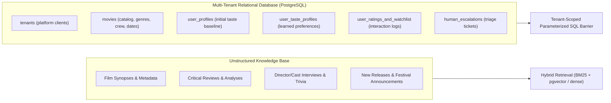
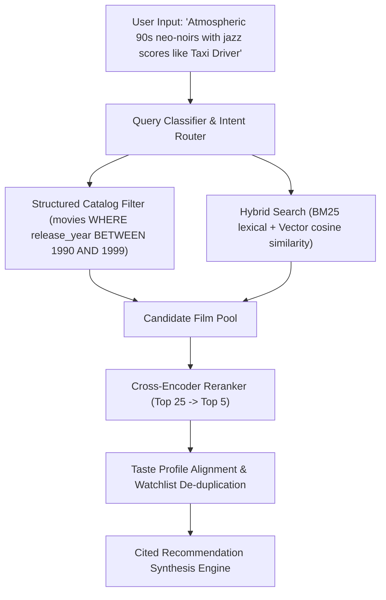
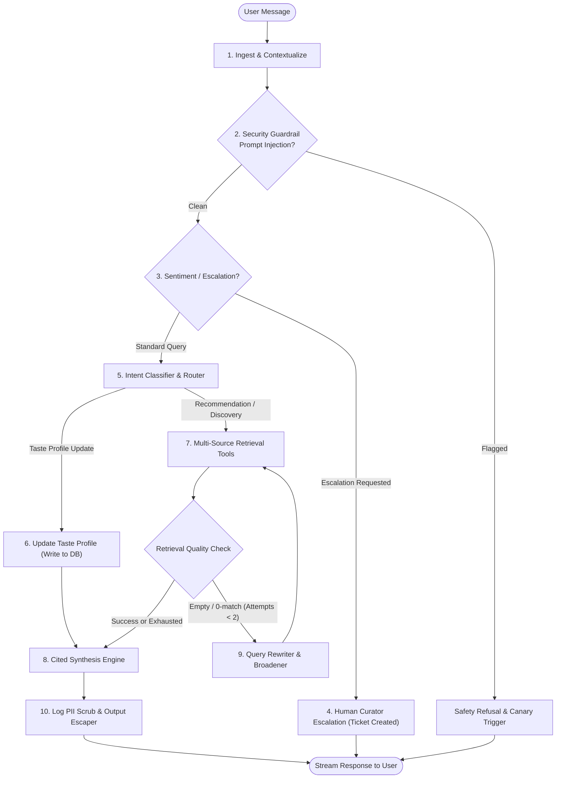

# Phase 6 Capstone Design Document: CineMatch AI

## Project Overview: CineMatch AI
**CineMatch AI** is an enterprise-grade, multi-tenant conversational movie intelligence and recommendation platform. Built for streaming networks, film festivals, and entertainment catalogs, it delivers personalized film recommendations and curated lists by continually evolving a user's taste profile through multi-turn dialogue, grounding every suggestion in multi-source knowledge (editorial reviews, director filmographies, synopses, and structured catalog metadata) with source citations, strict tenant data isolation, and human curator escalation.

---

## 1. Data Sources Architecture

The system unifies unstructured editorial film content with structured relational catalog and user profile data.



### Unstructured Sources
* **Catalog Content & Synopses**: Detailed plot outlines, thematic tags, production trivia, and director notes.
* **Critical Reviews & Editorial Analyses**: In-depth critiques, stylistic breakdowns (e.g., cinematography, tone, pacing), and awards recognition.
* **New Releases & Festival Radar**: Weekly upcoming releases, release windows (theatrical vs. streaming drops), and festival highlights.
* *Ingestion & Chunking*: Markdown/HTML chunking with semantic boundaries, preserving metadata (`movie_id`, `title`, `release_year`, `director`, `source_type`, `url`).

### Structured Sources (PostgreSQL Schema)
* `tenants`: `tenant_id` (PK), `name`, `catalog_region`, `tier_config`.
* `movies`: `movie_id` (PK), `tenant_id`, `title`, `release_date`, `genres` (array), `director`, `cast_members` (array), `runtime_mins`, `content_rating`, `streaming_url`, `synopsis`.
* `user_profiles`: `user_id` (PK), `tenant_id`, `name`, `baseline_preferences` (JSONB: favorite genres, seed movies, disliked tropes).
* `user_taste_profiles`: `user_id` (PK), `tenant_id`, `affinity_directors` (JSONB), `affinity_genres` (JSONB), `affinity_actors` (JSONB), `mood_affinities` (JSONB), `taste_summary` (text), `last_updated_at`.
* `user_ratings_and_watchlist`: `id` (PK), `tenant_id`, `user_id`, `movie_id`, `status` (`watched`, `want_to_watch`, `favorite`, `disliked`), `rating` (1-10), `notes`.
* `human_escalations`: `ticket_id` (PK), `tenant_id`, `user_id`, `conversation_id`, `reason`, `transcript_summary`, `status` (`pending`, `assigned`, `resolved`), `created_at`.

---

## 2. Retrieval Strategy

CineMatch combines hybrid semantic search over unstructured reviews/synopses with deterministic relational SQL filters.



1. **Hybrid Retrieval (RRF)**:
   * **Dense Vector Search**: Embedding distance over synopses and mood descriptions using cosine similarity.
   * **Lexical BM25**: Exact matches on director names, actors, niche sub-genres, and specific film titles.
   * **Reciprocal Rank Fusion (RRF)**: Merges dense and sparse ranks with constant k=60.
2. **Cross-Encoder Reranking**:
   * Evaluates top 25 candidates against user prompt and current mood state, outputting the top 5 most relevant films.
3. **Taste Alignment & Deduplication**:
   * Automatically cross-checks candidates against user's `watched` list (to prevent recommending films they've already seen unless requested).
4. **Source Citations**:
   * Every recommended film generates verifiable citations:
     * `[Source: Catalog: Taxi Driver (1976) | Dir: Martin Scorsese | ID: mov_842]`
     * `[Source: Review: Sight & Sound Retrospective | URL: /editorial/neo-noir-moods]`

---

## 3. Agent Graph Architecture (LangGraph)

The agent is modeled as an explicit state machine with cyclic query expansion, taste learning, and human escalation.



### Graph Nodes
* **`intake`**: Loads user state from Postgres checkpointer, validates active tenant and user session.
* **`security_guardrail`**: Scans inputs for injection patterns and wraps context in `<untrusted_context>` envelopes.
* **`intent_classifier`**: Routes between:
  1. *Taste Profiling* (user shares thoughts: "I loved Arrival because of the nonlinear storytelling").
  2. *Discovery & Recommendation* ("Recommend me 3 psychological thrillers from the last 2 years").
  3. *New Releases Radar* ("What new films came out this month matching my taste?").
  4. *Human Escalation* (frustration, explicit request for human curator, or billing/account issues).
* **`multi_source_tools`**: Calls `search_catalog_unstructured`, `query_catalog_sql`, and `fetch_user_watchlist`.
* **`query_rewriter`**: When search returns 0 matches or low relevance, reformulates the query (up to 2 retries) before graceful degradation.
* **`update_taste_profile`**: Extracts director/genre/mood affinities and writes updated preferences to `user_taste_profiles`.
* **`human_escalation`**: Freezes agent loop, inserts an escalation ticket into `human_escalations`, and yields human handoff notification.
* **`synthesizer`**: Compiles the final recommendation with mandatory citations.

---

## 4. State Schema

```python
from typing import Annotated, Any, Dict, List, Optional
from pydantic import BaseModel, Field
from langgraph.graph.message import add_messages


class FilmCitation(BaseModel):
    movie_id: str
    title: str
    year: int
    director: str
    source_type: str  # "catalog_metadata", "editorial_review", "new_release"
    citation_label: str
    reference_url: Optional[str] = None


class TasteDelta(BaseModel):
    new_liked_directors: List[str] = Field(default_factory=list)
    new_disliked_directors: List[str] = Field(default_factory=list)
    new_liked_genres: List[str] = Field(default_factory=list)
    new_disliked_genres: List[str] = Field(default_factory=list)
    mood_keywords: List[str] = Field(default_factory=list)
    taste_notes: Optional[str] = None


class CineMatchState(BaseModel):
    messages: Annotated[List[Dict[str, Any]], add_messages]
    tenant_id: str
    user_id: str
    conversation_id: str
    active_intent: str = "recommendation"
    taste_profile: Dict[str, Any] = Field(default_factory=dict)
    retrieved_candidates: List[Dict[str, Any]] = Field(default_factory=list)
    citations: List[FilmCitation] = Field(default_factory=list)
    retry_count: int = 0
    escalation_status: Optional[str] = None  # None, "pending", "escalated"
    escalation_ticket_id: Optional[str] = None
    step_telemetry: List[Dict[str, Any]] = Field(default_factory=list)
```

---

## 5. Tenant Isolation & Security Architecture

1. **Row-Level Security (RLS) & Query Scoping**:
   * All database queries require explicit `WHERE tenant_id = :tenant_id AND user_id = :user_id`.
   * SQL queries are validated through the `SafeQueryExecutor` built in Phase 5 with read-only AST parse tree checks, blocking cross-tenant table joins.
2. **Vector Space Partitioning**:
   * Vector search queries enforce mandatory payload metadata filters: `{"tenant_id": {"$eq": tenant_id}}`.
3. **Indirect Prompt Injection Neutralization**:
   * Third-party user reviews and scraped festival previews are encased in `<untrusted_context>` XML envelopes with CDATA shields.
4. **Output Safety**:
   * Model outputs are escaped before web rendering; movie streaming URLs are sanitized to prevent `javascript:` XSS vectors.
5. **PII Redaction**:
   * User emails, IP addresses, credit card tokens, and bearer keys are scrubbed by `PIILoggingFilter` before entering telemetry or logs.

---

## 6. Evaluation & Security Verification Plan

### Quantitative Benchmark Suite
* **Retrieval Recall@5 & NDCG@5**: Evaluated over 30 multi-turn test queries against a curated movie golden dataset.
* **Citation Accuracy**: 100% of recommended titles must have corresponding valid catalog IDs and source URLs.
* **Taste Profile Update Fidelity**: Verify that expressing preferences in turn N alters recommendations in turn N+1.
* **LLM Judge Evaluation**: Calibrated LLM-as-judge scoring recommendations on Relevancy, Groundedness, and Absence of Hallucination.

### Security Penetration Test Suite (`SECURITY_REPORT.md`)
1. **Cross-Tenant Attack**: User from `tenant_A` attempts to fetch watchlists or private reviews belonging to `tenant_B`.
2. **SQL Injection**: Inputting malicious movie titles (`' OR 1=1 --`) through search tools.
3. **Indirect Injection in Reviews**: Planting malicious system-override prompts in film synopses to force unauthorized recommendations.
4. **PII Leakage Audit**: Verifying 0.0% PII in logs during active chat sessions.

---

## 7. Proposed Milestone Breakdown (Phase 6 Tasks)

* **Task 6.1 (Current)**: Capstone Design Doc (`DESIGN.md`) covering sources, retrieval, graph, schema, tenant isolation, and eval plan.
* **Task 6.2**: Data Layer & Multi-Source Retrieval Engine (PostgreSQL schemas, seed catalog, vector store, hybrid RRF search, and tenant isolation).
* **Task 6.3**: Stateful Agent Graph with Dynamic Taste Learning & Human Escalation (LangGraph, Postgres checkpointer, query rewrite cycle, and escalation node).
* **Task 6.4**: Production Hardening, Eval Benchmark Suite, Security Pentest Report & Docker Deployment (FastAPI SSE streaming, test suite with numbers, `SECURITY_REPORT.md`, and Dockerfile).
